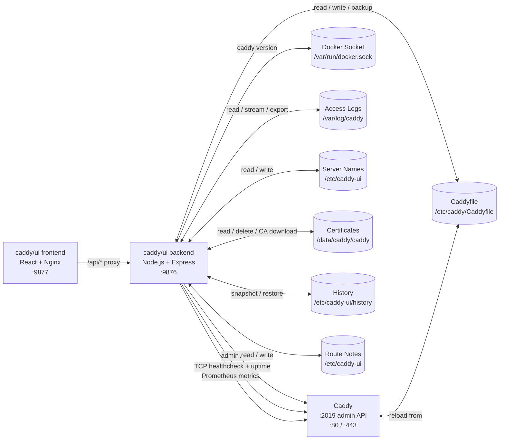

# caddy/ui

A modern web interface for managing your [Caddy](https://caddyserver.com) server. Built from scratch in a single conversation with Claude.


## Overview

caddy/ui is a self-hosted management interface for Caddy. It runs as two Docker containers alongside your existing Caddy instance and communicates with Caddy's built-in admin API. Your Caddyfile remains the source of truth — the UI reads from it, writes to it, and never takes ownership away from you.

## Features

- **Dashboard** — Live server status, TLS state, server block summary with custom display names, upstream health overview, and Caddy process info (version, uptime, memory, last reload)
- **Caddyfile Editor** — Edit your Caddyfile with syntax highlighting, live validation, `caddy fmt` formatting, automatic site block sorting, backup/restore, and full version history with inline preview and one-click rollback
- **Route Manager** — View all reverse proxy routes across all server blocks, with live upstream healthchecks, uptime percentages, search/filter, clickable domain and upstream links, edit routes in-place, and per-route notes
- **TLS Certificates** — View cert status, expiry dates, and days remaining for all managed domains. Detect and delete orphaned certs. Download Caddy's root CA cert with per-OS install instructions
- **Access Logs** — Tail live log output with SSE streaming, real-time keyword search, ERROR/WARN/INFO level filters, and log export
- **Log Configuration** — Enable, disable, and configure Caddy access logging directly from the UI
- **Metrics** — Request count, RPS, avg response time, status code breakdown, and p50/p95/p99 percentiles powered by Caddy's built-in Prometheus endpoint
- **Dark/Light Theme** — Toggle between dark and warm off-white themes, persisted across sessions
- **Authentication** — Optional JWT-based login screen protecting the UI and all API endpoints
- **Mobile Friendly** — Responsive layout with collapsible sidebar

## Architecture



## Quick Start

### Prerequisites

- Docker and Docker Compose
- An existing Caddy container with the admin API enabled

### 1. Enable Caddy's admin API

Add `CADDY_ADMIN=0.0.0.0:2019` to your Caddy container's environment variables.

### 2. Create required directories

```bash
mkdir -p /docker/caddy/logs
mkdir -p /docker/caddy-ui
```

### 3. Generate a JWT secret

```bash
openssl rand -base64 32
```

### 4. Update your compose file

```yaml
services:
  caddy:
    image: caddy:latest
    container_name: caddy
    restart: unless-stopped
    ports:
      - 80:80
      - 443:443
    environment:
      - CADDY_ADMIN=0.0.0.0:2019
    volumes:
      - /docker/caddy/Caddyfile:/etc/caddy/Caddyfile
      - /docker/caddy/data:/data
      - /docker/caddy/config:/config
      - /docker/caddy/logs:/var/log/caddy
    networks:
      - caddy-ui

  caddy-ui-backend:
    image: zackwag/caddy-ui-backend:latest
    container_name: caddy-ui-backend
    restart: unless-stopped
    ports:
      - 9876:3001
    environment:
      - PORT=3001
      - CADDY_ADMIN_URL=http://caddy:2019
      - CADDYFILE_PATH=/etc/caddy/Caddyfile
      - CADDY_LOG_PATH=/var/log/caddy/access.log
      - SERVER_NAMES_PATH=/etc/caddy-ui/server-names.json
      - CADDY_DATA_PATH=/data/caddy/caddy
      - HISTORY_PATH=/etc/caddy-ui/history
      - ROUTE_NOTES_PATH=/etc/caddy-ui/route-notes.json
      - CADDY_UI_USER=admin
      - CADDY_UI_PASSWORD=yourpassword
      - JWT_SECRET=your-long-random-secret
      - CADDY_UI_PUBLIC_METRICS=false
    volumes:
      - /var/run/docker.sock:/var/run/docker.sock
      - /docker/caddy/Caddyfile:/etc/caddy/Caddyfile
      - /docker/caddy/logs:/var/log/caddy
      - /docker/caddy-ui:/etc/caddy-ui
      - /docker/caddy/data:/data/caddy
    networks:
      - caddy-ui
    depends_on:
      - caddy

  caddy-ui-frontend:
    image: zackwag/caddy-ui-frontend:latest
    container_name: caddy-ui-frontend
    restart: unless-stopped
    ports:
      - 9877:80
    networks:
      - caddy-ui
    depends_on:
      - caddy-ui-backend

networks:
  caddy-ui:
    driver: bridge
```

### 5. Deploy

```bash
docker compose up -d
```

Open `http://your-server:9877` in your browser.

## Authentication

Authentication is disabled by default. Set `CADDY_UI_USER`, `CADDY_UI_PASSWORD`, and `JWT_SECRET` to enable it. All API endpoints are protected and the login screen appears automatically.

## Environment Variables in Caddyfile

Caddy supports `{$VAR_NAME}` syntax in the Caddyfile. caddy/ui resolves these via the `/adapt` endpoint before reloading, so env vars work correctly end-to-end:

```
{
    email {$EMAIL}
}

blog.{$DOMAIN} {
    reverse_proxy 192.168.4.88:8250
}
```

Set the vars in your Caddy container's environment or a shared `.env` file.

## Prometheus Metrics

Enable Caddy's metrics endpoint from the Metrics tab, or add `metrics` to your Caddyfile global block manually. Set `CADDY_UI_PUBLIC_METRICS=true` to expose `/api/metrics` without auth for Prometheus scraping.

## Building from Source

```bash
cd backend && docker build -t caddy-ui-backend .
cd frontend && docker build -t caddy-ui-frontend .
```

## Project Structure

```text
caddy-ui/
├── backend/
│   ├── src/
│   │   ├── index.js
│   │   ├── caddy.js
│   │   ├── middleware/
│   │   │   └── auth.js
│   │   └── routes/
│   │       ├── auth.js
│   │       ├── caddyfile.js
│   │       ├── routes.js
│   │       ├── status.js
│   │       ├── logs.js
│   │       ├── tls.js
│   │       ├── health.js
│   │       ├── servernames.js
│   │       └── routenotes.js
│   ├── Dockerfile
│   └── package.json
├── frontend/
│   ├── src/
│   │   ├── main.jsx
│   │   └── App.jsx
│   ├── Dockerfile
│   ├── nginx.conf
│   ├── vite.config.js
│   ├── index.html
│   └── package.json
└── README.md
```

## Docker Hub

| Image    | Link                                                                            |
| -------- | ------------------------------------------------------------------------------- |
| Frontend | [zackwag/caddy-ui-frontend](https://hub.docker.com/r/zackwag/caddy-ui-frontend) |
| Backend  | [zackwag/caddy-ui-backend](https://hub.docker.com/r/zackwag/caddy-ui-backend)   |

## Changelog

| Version | Description                                                                                                               |
| ------- | ------------------------------------------------------------------------------------------------------------------------- |
| `v1.9`  | Dark/light theme toggle, log export, root CA cert download, Caddy version via Docker socket, env var support in Caddyfile |
| `v1.8`  | Metrics tab, upstream uptime tracking, simplified dashboard process card                                                  |
| `v1.7`  | JWT auth, Caddy process info, metrics toggle, public metrics endpoint                                                     |
| `v1.6`  | Edit routes in-place, route notes, Caddyfile syntax highlighting                                                          |
| `v1.5`  | Caddyfile version history with snapshots, log search and level filters                                                    |
| `v1.4`  | Dashboard health summary, route search/filter, Caddyfile backup and restore                                               |
| `v1.3`  | Upstream healthchecks, clickable domain/upstream links, http/https scheme detection                                       |
| `v1.2`  | TLS certificate tab, orphaned cert cleanup, all server routes visible, mobile layout                                      |
| `v1.1`  | Mobile responsive layout, hamburger menu                                                                                  |
| `v1.0`  | Initial release                                                                                                           |

## License

MIT
