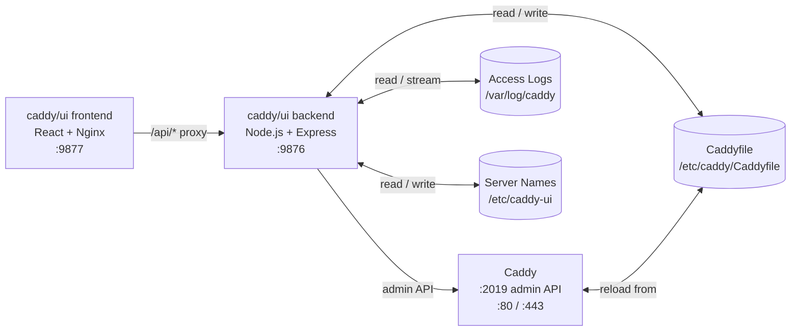

# caddy/ui

A modern, dark-themed web interface for managing your [Caddy](https://caddyserver.com) server. Built from scratch in a single conversation with Claude.


## Overview

caddy/ui is a self-hosted management interface for Caddy. It runs as two Docker containers alongside your existing Caddy instance and communicates with Caddy's built-in admin API. Your Caddyfile remains the source of truth — the UI reads from it, writes to it, and never takes ownership away from you.

## Features

- **Dashboard** — Live server status, TLS state, and server block summary with custom display names
- **Caddyfile Editor** — Edit your Caddyfile in the browser with live validation, `caddy fmt` formatting, and automatic site block sorting on save
- **Route Manager** — View all reverse proxy routes across all server blocks, add new routes and delete existing ones with automatic Caddyfile sync
- **Access Logs** — Tail live log output with SSE streaming, color-coded by severity level
- **Log Configuration** — Enable, disable, and configure Caddy access logging directly from the UI
- **Mobile Friendly** — Responsive layout with collapsible sidebar

## Architecture



## Quick Start

### Prerequisites

- Docker and Docker Compose
- An existing Caddy container with the admin API enabled

### 1. Enable Caddy's admin API

Add `CADDY_ADMIN=0.0.0.0:2019` to your Caddy container's environment variables. Your Caddyfile global block just needs your email:

```json
{
    email you@example.com
}
```

### 2. Create the log directory

```bash
mkdir -p /docker/caddy/logs
mkdir -p /docker/caddy-ui
```

### 3. Update your compose file

Add the following services and update your existing `caddy` service:

```yaml
services:
  caddy:
    image: caddy:latest
    # ... your existing config, plus:
    environment:
      - CADDY_ADMIN=0.0.0.0:2019
    volumes:
      # ... your existing volumes, plus:
      - /docker/caddy/logs:/var/log/caddy
    networks:
      - caddy-ui

  caddy-ui-backend:
    image: zackwag/caddy-ui-backend:latest
    container_name: caddy-ui-backend
    restart: unless-stopped
    ports:
      - 9876:3001
    environment:
      - PORT=3001
      - CADDY_ADMIN_URL=http://caddy:2019
      - CADDYFILE_PATH=/etc/caddy/Caddyfile
      - CADDY_LOG_PATH=/var/log/caddy/access.log
      - SERVER_NAMES_PATH=/etc/caddy-ui/server-names.json
    volumes:
      - /docker/caddy/Caddyfile:/etc/caddy/Caddyfile
      - /docker/caddy/logs:/var/log/caddy
      - /docker/caddy-ui:/etc/caddy-ui
    networks:
      - caddy-ui
    depends_on:
      - caddy

  caddy-ui-frontend:
    image: zackwag/caddy-ui-frontend:latest
    container_name: caddy-ui-frontend
    restart: unless-stopped
    ports:
      - 9877:80
    networks:
      - caddy-ui
    depends_on:
      - caddy-ui-backend

networks:
  caddy-ui:
    driver: bridge
```

### 4. Deploy

```bash
docker compose up -d
```

Open `http://your-server:9877` in your browser.

## Building from Source

See the [backend README](./backend/README.md) and [frontend README](./frontend/README.md) for individual build instructions.

```bash
# Build backend
cd backend
docker build -t caddy-ui-backend .

# Build frontend
cd frontend
docker build -t caddy-ui-frontend .
```

## Project Structure

```text
caddy-ui/
├── backend/                  # Node.js/Express API server
│   ├── src/
│   │   ├── index.js          # Entry point
│   │   ├── caddy.js          # Caddy admin API client
│   │   └── routes/
│   │       ├── caddyfile.js  # Caddyfile read/write/validate/reload
│   │       ├── routes.js     # Reverse proxy route management
│   │       ├── status.js     # Server status
│   │       ├── logs.js       # Log tailing and configuration
│   │       └── servernames.js # Server block display names
│   ├── Dockerfile
│   └── package.json
├── frontend/                 # React application
│   ├── src/
│   │   ├── main.jsx          # Entry point
│   │   └── App.jsx           # Full application
│   ├── Dockerfile
│   ├── nginx.conf            # Nginx config with /api proxy
│   ├── vite.config.js
│   ├── index.html
│   └── package.json
└── docker-compose.additions.yml
```

## Docker Hub

| Image    | Link                                                                            |
|----------|---------------------------------------------------------------------------------|
| Frontend | [zackwag/caddy-ui-frontend](https://hub.docker.com/r/zackwag/caddy-ui-frontend) |
| Backend  | [zackwag/caddy-ui-backend](https://hub.docker.com/r/zackwag/caddy-ui-backend)   |

## License

MIT
