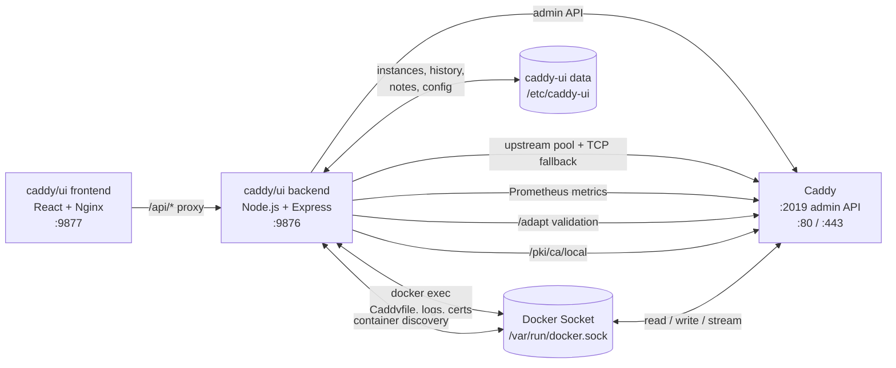

# caddy/ui

A modern web interface for managing your [Caddy](https://caddyserver.com) server. Built from scratch in a single conversation with Claude.


## Overview

caddy/ui is a self-hosted management interface for Caddy. It runs as two Docker containers alongside your Caddy instance(s) and communicates with Caddy's built-in admin API. Your Caddyfile remains the source of truth — the UI reads from it, writes to it, and never takes ownership away from you. Manage one Caddy server or many from a single interface.

## Screenshots

### Dashboard


### Caddyfile Editor


### Route Manager


### TLS Certificates


### Access Logs


### Metrics


## Features

- **Dashboard** — Live server status, TLS state, server block summary with custom display names, upstream health overview, and Caddy process info (version, uptime, memory, last reload)
- **Caddyfile Editor** — Edit your Caddyfile with [real Caddyfile-grammar syntax highlighting](#caddyfile-syntax-highlighting) (directives, matchers, placeholders, env vars — not a generic nginx approximation), live validation, `caddy fmt` formatting, automatic site block sorting, export/import, and full version history with inline preview and one-click rollback
- **Route Manager** — View all reverse proxy routes across all server blocks, with live upstream healthchecks, uptime percentages, search/filter by domain, upstream, note, or server, clickable domain and upstream links, edit routes in-place, and per-route notes
- **TLS Certificates** — View cert status, expiry dates, and sortable columns for all managed domains. Detect and delete orphaned certs. Download Caddy's root CA cert with per-OS install instructions
- **Access Logs** — Tail live log output with SSE streaming, real-time keyword search, ERROR/WARN/INFO level filters, and log export
- **Log Configuration** — Enable, disable, and configure Caddy access logging directly from the UI
- **Metrics** — Request count, RPS, avg response time, status code breakdown, and p50/p95/p99 percentiles powered by Caddy's built-in Prometheus endpoint
- **Notifications** — Push alerts via ntfy, Discord, Slack, Pushover, or custom webhook when upstreams go offline/online or TLS certs are expiring. Configurable debounce and per-trigger opt-in
- **Dark/Light Theme** — Toggle between dark and warm off-white themes, persisted across sessions
- **URL-Based Navigation** — Full browser history support, bookmarkable URLs, and deep links (e.g. `/routes?filter=srv0`)
- **Authentication** — Optional JWT-based login screen protecting the UI and all API endpoints
- **Multi-Instance** — Manage multiple Caddy instances from a single UI. Auto-discover Caddy containers on your Docker network, add/edit/remove instances from the Instances page, and switch between them with the sidebar instance switcher
- **Mobile Friendly** — Responsive layout with collapsible sidebar

## Architecture


```mermaid
graph LR
    FE["caddy/ui frontend\nReact + Nginx\n:9877"]
    BE["caddy/ui backend\nNode.js + Express\n:9876"]
    DS[("Docker Socket\n/var/run/docker.sock")]
    CA["Caddy\n:2019 admin API\n:80 / :443"]
    UI_DATA[("caddy-ui data\n/etc/caddy-ui")]

    FE -->|"/api/* proxy"| BE
    BE -->|"admin API"| CA
    BE -->|"upstream pool + TCP fallback"| CA
    BE -->|"Prometheus metrics"| CA
    BE -->|"/adapt validation"| CA
    BE -->|"/pki/ca/local"| CA
    BE <-->|"docker exec\nCaddyfile, logs, certs"| DS
    DS <-->|"read / write / stream"| CA
    BE <-->|"container discovery"| DS
    BE <-->|"instances, history,\nnotes, config"| UI_DATA
```

## Quick Start

### Prerequisites

- Docker and Docker Compose
- An existing Caddy container with the admin API enabled on `0.0.0.0:2019`

### 1. Enable Caddy's admin API

Add the following to your Caddyfile global block:

```caddyfile
{
    admin 0.0.0.0:2019
    email {$EMAIL}
}
```

> Note: the `CADDY_ADMIN` environment variable does not configure this — it must be set in the Caddyfile.

### 2. Create required directories

```bash
mkdir -p /docker/caddy/logs
mkdir -p /docker/caddy-ui
```

### 3. Generate a JWT secret (if using auth)

```bash
openssl rand -base64 32
```

### 4. Update your compose file

```yaml
services:
  caddy:
    image: caddy:latest
    container_name: caddy
    restart: unless-stopped
    ports:
      - 80:80
      - 443:443
    environment:
      - CADDY_LOG_PATH=/var/log/caddy/access.log
      - DOMAIN=example.com
      - EMAIL=you@example.com
      - TZ=America/New_York
    volumes:
      - /docker/caddy/Caddyfile:/etc/caddy/Caddyfile
      - /docker/caddy/data:/data
      - /docker/caddy/config:/config
      - /docker/caddy/logs:/var/log/caddy
    networks:
      - caddy-ui

  caddy-ui-backend:
    image: zackwag/caddy-ui-backend:latest
    container_name: caddy-ui-backend
    restart: unless-stopped
    ports:
      - 9876:3001
    environment:
      - TZ=America/New_York
      # Optional -- leave unset to disable auth
      - CADDY_UI_USER=admin
      - CADDY_UI_PASSWORD=yourpassword
      - JWT_SECRET=your-long-random-secret
    volumes:
      - /var/run/docker.sock:/var/run/docker.sock
      - /docker/caddy-ui:/etc/caddy-ui
    networks:
      - caddy-ui
    depends_on:
      - caddy

  caddy-ui-frontend:
    image: zackwag/caddy-ui-frontend:latest
    container_name: caddy-ui-frontend
    restart: unless-stopped
    ports:
      - 9877:80
    networks:
      - caddy-ui
    depends_on:
      - caddy-ui-backend

networks:
  caddy-ui:
    driver: bridge
```

The backend only needs two volumes: the **Docker socket** (to interact with Caddy containers via `docker exec` and discover new instances) and its own **config directory** (for instance registry, history, and settings). No Caddy volume mounts required — all Caddyfile, log, and certificate operations go through the Docker socket.

### 5. Deploy

```bash
docker compose up -d
```

Open `http://your-server:9877` in your browser.

## Environment Variables

All backend variables have sensible defaults. Only set what you need to override.

| Variable | Default | Description |
|----------|---------|-------------|
| `APP_VERSION` | `dev` | caddy-ui's own version, exposed at `GET /api/version` and shown in the sidebar. Baked in automatically by the release build (`docker build --build-arg APP_VERSION=...`) — no need to set by hand unless building from source and want the UI to report a specific version. |
| `CADDY_ADMIN_URL` | — | URL of Caddy's admin API. If set, a default instance is auto-created on first startup. If unset, caddy/ui starts with no instances and guides you through discovery. |
| `CADDYFILE_TITLES` | auto | Store route titles as `#` comments in the Caddyfile (see [Caddyfile Titles](#caddyfile-titles)) |
| `CADDY_CONFIG_PATH` | `/etc/caddy/Caddyfile` | Path to the Caddyfile inside the Caddy container (only used with `CADDY_ADMIN_URL`) |
| `CADDY_CONTAINER_NAME` | `caddy` | Name of the Caddy Docker container (only used with `CADDY_ADMIN_URL`) |
| `CADDY_DATA_PATH` | `/data/caddy` | Path to Caddy's data directory inside the container (only used with `CADDY_ADMIN_URL`) |
| `CADDY_LOG_PATH` | `/var/log/caddy/access.log` | Path to Caddy's access log inside the container (only used with `CADDY_ADMIN_URL`) |
| `CADDY_SERVER_NAME` | `srv0` | Primary server block name for new routes (only used with `CADDY_ADMIN_URL`) |
| `CADDY_UI_PASSWORD` | — | Password for UI authentication |
| `CADDY_UI_PUBLIC_METRICS` | `false` | Expose `/api/metrics/raw` without auth |
| `CADDY_UI_USER` | — | Username for UI authentication (leave unset to disable) |
| `DOCKER_SOCKET` | `/var/run/docker.sock` | Path to the Docker socket for container discovery and `docker exec` operations |
| `HISTORY_PATH` | `/etc/caddy-ui/history` | Path to the Caddyfile snapshot directory |
| `INSTANCES_PATH` | `/etc/caddy-ui/instances.json` | Path to the multi-instance configuration file (see [Multi-Instance](#multi-instance)) |
| `JWT_SECRET` | — | Secret key for signing JWT tokens |
| `LOG_LEVEL` | `info` | Log verbosity (`debug`, `info`, `warn`, `error`) |
| `NOTIFICATIONS_CONFIG_PATH` | `/etc/caddy-ui/notifications.json` | Path to the notification settings file |
| `PORT` | `3001` | Port the backend listens on |
| `ROUTE_NOTES_PATH` | `/etc/caddy-ui/route-notes.json` | Path to the route notes file |
| `SERVER_NAMES_PATH` | `/etc/caddy-ui/server-names.json` | Path to the server display names file |

## Authentication

Authentication is disabled by default. Set `CADDY_UI_USER`, `CADDY_UI_PASSWORD`, and `JWT_SECRET` to enable it. All API endpoints are protected and the login screen appears automatically.

## Multi-Instance

caddy/ui can manage multiple Caddy instances from a single interface. There are two modes for accessing Caddy's files, and you can mix them per-instance:

| | Docker mode | Local mode |
|---|---|---|
| **How it works** | `docker exec` via the Docker socket | Direct filesystem reads/writes |
| **Volumes needed** | Docker socket only | Caddy's Caddyfile, logs, and data dirs mounted into the backend |
| **Auto-discovery** | Yes | No |
| **Container Name field** | Set to the Caddy container name | Leave empty |

### Docker mode (recommended)

Mount the Docker socket into the backend and let caddy/ui talk to Caddy containers via `docker exec`. No per-instance volume mounts needed.

On first launch with no `CADDY_ADMIN_URL` set and no `instances.json`, caddy/ui starts with zero instances and redirects to the **Instances** page. From there:

1. Click **Discover** — caddy/ui scans the Docker network for running Caddy containers
2. Click **Add** on a discovered container — the form is pre-filled with the container's name, admin URL, and environment variables
3. Review and save

That's it. The instance appears in the sidebar and all pages load its data. Discovery also polls automatically every 30 seconds, so new containers appear on their own.

To add more instances, put them on the same Docker network and they'll show up in discovery:

```yaml
  caddy-staging:
    image: caddy:latest
    container_name: caddy-staging
    # ... ports, volumes, environment for the staging Caddy
    networks:
      - caddy-ui
```

### Local mode (no Docker socket)

If you can't or don't want to mount the Docker socket, leave the **Container Name** field empty when adding an instance. caddy/ui will access Caddyfiles, logs, and certificates directly from the filesystem and use the bundled `caddy` binary for formatting, validation, and reload.

This requires mounting each Caddy instance's files into the backend container:

```yaml
  caddy-ui-backend:
    volumes:
      - /docker/caddy-ui:/etc/caddy-ui
      - /docker/caddy/Caddyfile:/etc/caddy/Caddyfile
      - /docker/caddy/logs:/var/log/caddy
      - /docker/caddy/data:/data/caddy
```

Then add the instance manually on the Instances page with Container Name left empty. The paths in the instance config must match where the files are mounted in the backend container.

> **Note:** When managing multiple instances in local mode, the mount paths can't collide. Two Caddy instances both using `/etc/caddy/Caddyfile` inside their own containers would need to be mounted to different paths in the backend (e.g., `/etc/caddy-prod/Caddyfile` and `/etc/caddy-staging/Caddyfile`).

### Instance switcher

When more than one instance is configured, an instance switcher dropdown appears in the sidebar showing each instance with its online/offline status. Switching instances navigates to the Dashboard and reloads all data from the selected instance.

### Manual configuration

Instances can also be configured via the REST API (`POST /api/instances`) or by placing an `instances.json` file at `/etc/caddy-ui/instances.json`:

```json
[
  {
    "id": "production",
    "name": "Production",
    "adminUrl": "http://caddy:2019",
    "configPath": "/etc/caddy/Caddyfile",
    "logPath": "/var/log/caddy/access.log",
    "dataPath": "/data/caddy",
    "containerName": "caddy",
    "serverName": "srv0"
  },
  {
    "id": "local-caddy",
    "name": "Local Caddy",
    "adminUrl": "http://localhost:2019",
    "configPath": "/etc/caddy-local/Caddyfile",
    "logPath": "/var/log/caddy-local/access.log",
    "dataPath": "/data/caddy-local/caddy",
    "containerName": "",
    "serverName": "srv0"
  }
]
```

Set `containerName` to the Docker container name for Docker mode, or `""` for local mode.

### Backward compatibility

Setting `CADDY_ADMIN_URL` still creates a default instance on startup for existing deployments. Remove it to use discovery-based setup instead.

## Caddyfile Titles

When enabled, route titles are stored as `#` comments inside each site block in your Caddyfile instead of in `route-notes.json`. This keeps titles co-located with the routes they describe and follows caddy/ui's principle of using the Caddyfile as the source of truth.

```caddyfile
blog.example.com {
    # My Blog
    reverse_proxy 192.168.4.88:8250
}
```

The first `#` comment inside a site block is treated as the title. It appears in the Route Manager search results and in the edit modal's Title field.

**Auto-detection (default):** On startup, if `route-notes.json` has existing entries, Caddyfile titles are disabled so nothing changes. On a fresh install with no notes, it is enabled automatically.

**Manual override:** Set the `CADDYFILE_TITLES` environment variable to `true` or `false` to force the behavior. When switching from `route-notes.json` to Caddyfile titles, existing notes will appear as the default title in the edit modal — save the route to write the title into the Caddyfile.

## Environment Variables in Caddyfile

Caddy supports `{$VAR_NAME}` syntax in the Caddyfile. Set the vars in your Caddy container's environment and they will be substituted at reload time:

```caddyfile
{
    admin 0.0.0.0:2019
    email {$EMAIL}
}

blog.{$DOMAIN} {
    reverse_proxy 192.168.4.88:8250
}
```

## Prometheus Metrics

Enable Caddy's metrics endpoint from the Metrics tab, or add `metrics` to your Caddyfile global block manually. Set `CADDY_UI_PUBLIC_METRICS=true` to expose `/api/metrics/raw` without auth for Prometheus scraping.

```yaml
scrape_configs:
  - job_name: caddy
    static_configs:
      - targets: ['caddy-ui-backend:3001']
    metrics_path: /api/metrics/raw
```

## Homepage Widget

The status endpoint returns enriched data for use with [Homepage](https://gethomepage.dev):

```yaml
- Caddy:
    href: https://caddy.home
    icon: caddy.png
    widget:
        type: customapi
        url: http://caddy-ui-backend:3001/api/status
        mappings:
            - field: online
              label: Status
              format: text
              remap:
                  - value: true
                    to: Online
                  - value: false
                    to: Offline
            - field: routeCount
              label: Routes
              format: number
            - field: upstreamsOnline
              label: Upstreams
              format: number
            - field: uptime
              label: Uptime
              format: text
```

## Building from Source

```bash
cd backend && docker build -t caddy-ui-backend .
cd frontend && docker build -t caddy-ui-frontend .
```

The backend image copies the Caddy binary from `caddy:latest` at build time for `caddy fmt` formatting and version detection. To pin to a specific Caddy version, edit the first line of the backend Dockerfile before building:

```dockerfile
COPY --from=caddy:v2.11.2 /usr/bin/caddy /usr/bin/caddy
```

If you run Caddy outside of Docker (e.g. systemd), the backend will still work correctly — `caddy fmt` and version detection will degrade gracefully if the binary version doesn't match or is unavailable.

## Caddyfile Syntax Highlighting

The editor's Caddyfile highlighting is a [CodeMirror 6](https://codemirror.net/) `StreamLanguage` mode generated from [**zackwag/caddyfile-codemirror**](https://github.com/zackwag/caddyfile-codemirror), a small companion repo that stays in sync — automatically, every day — with the Caddyfile keyword vocabulary (directives, global options, subdirectives, matcher names, and plugin vocabulary) from [**Sean Whalen**](https://github.com/seanthegeek)'s [**rouge-lexer-caddyfile**](https://github.com/seanthegeek/rouge-lexer-caddyfile), the [Rouge](http://rouge.jneen.net/) lexer Jekyll/GitHub Pages uses to highlight ` ```caddyfile ` code blocks. That gem is the actual research into Caddy's (and its most-downloaded plugins') documented syntax; the CodeMirror mode is a hand-written translation of its grammar into CodeMirror's token-stream API.

`frontend/scripts/fetch-caddyfile-mode.mjs` fetches the latest generated file at dev/build time (wired into `npm run dev` and `npm run build` via `predev`/`prebuild`), so `frontend/src/lib/caddyfileMode.js` is gitignored here rather than vendored by hand — it always reflects whatever `caddyfile-codemirror` last synced from the gem. If you're building offline, run `npm run dev`/`npm run build` once with connectivity first so the fetch has a local copy to fall back on.

## Project Structure

```text
caddy-ui/
├── backend/
│   ├── src/
│   │   ├── index.js
│   │   ├── caddy.js
│   │   ├── caddyfileTitles.js
│   │   ├── containerFs.js         ← docker exec wrapper for file ops inside Caddy containers
│   │   ├── docker.js
│   │   ├── dockerDiscovery.js     ← auto-discover Caddy containers via Docker socket
│   │   ├── instances.js
│   │   ├── logger.js
│   │   ├── notifications.js
│   │   ├── middleware/
│   │   │   ├── auth.js
│   │   │   └── instance.js
│   │   └── routes/
│   │       ├── auth.js
│   │       ├── caddyfile.js
│   │       ├── health.js
│   │       ├── instances.js
│   │       ├── logs.js
│   │       ├── metrics.js
│   │       ├── notifications.js
│   │       ├── routenotes.js
│   │       ├── routes.js
│   │       ├── servernames.js
│   │       ├── status.js
│   │       └── tls.js
│   ├── Dockerfile
│   ├── DOCKERHUB.md
│   └── package.json
├── frontend/
│   ├── src/
│   │   ├── components/
│   │   │   ├── CaddyFile.jsx
│   │   │   ├── Dashboard.jsx
│   │   │   ├── Instances.jsx      ← instance management page with discovery
│   │   │   ├── Login.jsx
│   │   │   ├── Logs.jsx
│   │   │   ├── Metrics.jsx
│   │   │   ├── Notifications.jsx
│   │   │   ├── Routes.jsx
│   │   │   ├── Sidebar.jsx
│   │   │   ├── TLS.jsx
│   │   │   └── Toasts.jsx
│   │   ├── utils/
│   │   │   ├── api.js
│   │   │   └── format.js
│   │   ├── lib/
│   │   │   └── caddyfileMode.js  (fetched at build time, gitignored)
│   │   ├── App.jsx
│   │   ├── main.jsx
│   │   └── styles.js
│   ├── scripts/
│   │   └── fetch-caddyfile-mode.mjs
│   ├── Dockerfile
│   ├── DOCKERHUB.md
│   ├── nginx.conf
│   ├── vite.config.js
│   ├── index.html
│   └── package.json
├── .github/
│   └── workflows/
│       ├── beta.yml
│       └── release.yml
└── README.md
```

## Docker Hub

| Image | Link |
|-------|------|
| Frontend | [zackwag/caddy-ui-frontend](https://hub.docker.com/r/zackwag/caddy-ui-frontend) |
| Backend | [zackwag/caddy-ui-backend](https://hub.docker.com/r/zackwag/caddy-ui-backend) |

## Changelog

| Version | Description |
|---------|-------------|
| `v1.17` | Report the running caddy-ui version via `GET /api/version` and the sidebar |
| `v1.16` | Real Caddyfile-grammar syntax highlighting (directives, matchers, placeholders, env vars) in place of a generic nginx-mode approximation |
| `v1.13` | `import` directive support in Caddyfile validation, reload, and sort; force-save option; validation timeout |
| `v1.12` | Push notifications via ntfy, Discord, Slack, Pushover, or custom webhook; automated release workflow with Docker Hub sync |
| `v1.11` | Caddy binary bundled, upstream pool health checks, CA download via admin API, simplified TLS cert deletion |
| `v1.10.1` | Caddy `/adapt` API validation, Docker socket removal |
| `v1.10` | React Router navigation, RESTful API audit, Homepage widget, enriched status endpoint |
| `v1.9` | Dark/light theme, log export, root CA download, env var support in Caddyfile |
| `v1.8` | Metrics tab, upstream uptime tracking |
| `v1.7` | JWT auth, Caddy process info, metrics toggle, public metrics endpoint |
| `v1.6` | Edit routes, route notes, Caddyfile syntax highlighting |
| `v1.5` | Caddyfile version history, log search and level filters |
| `v1.4` | Dashboard health summary, route search/filter, Caddyfile backup/restore |
| `v1.3` | Upstream healthchecks, clickable domain/upstream links |
| `v1.2` | TLS certificate tab, orphaned cert cleanup, mobile layout |
| `v1.1` | Mobile responsive layout, hamburger menu |
| `v1.0` | Initial release |

## License

MIT
