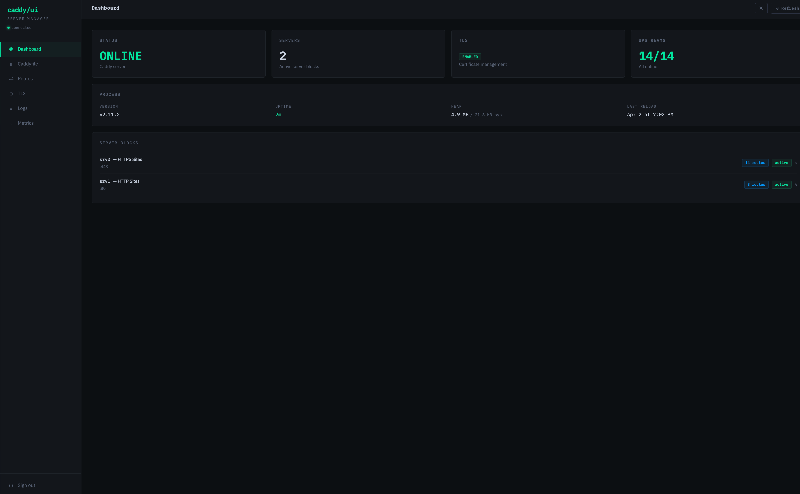
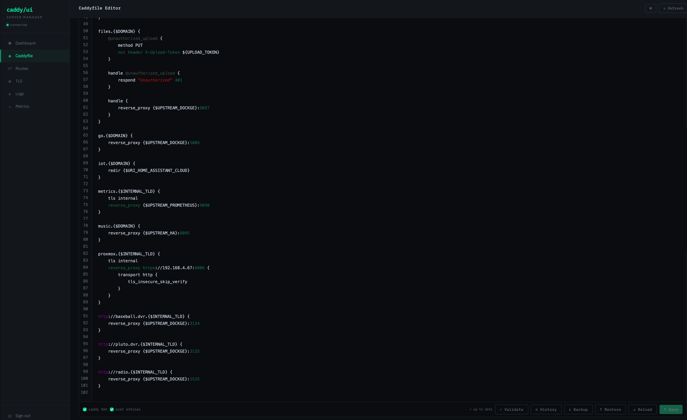
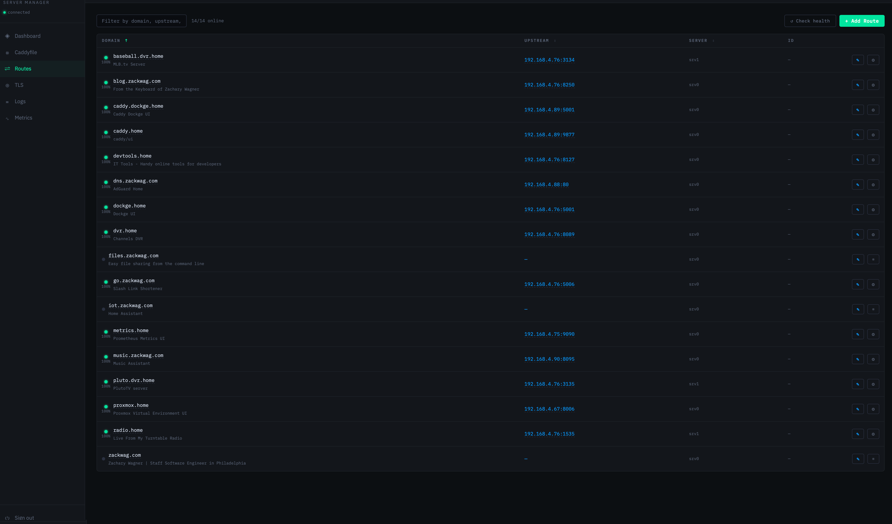
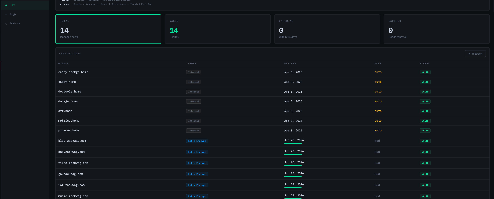
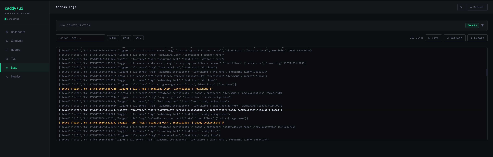
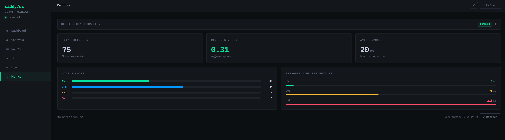
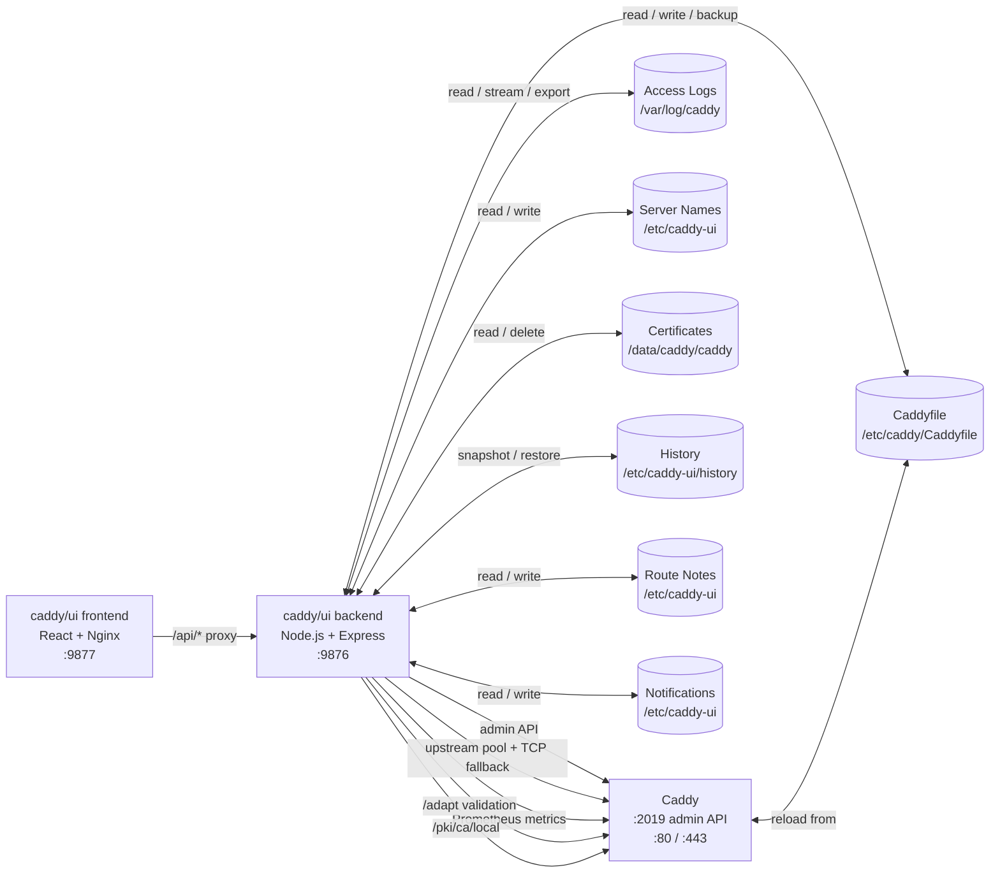

# caddy/ui

A modern web interface for managing your [Caddy](https://caddyserver.com) server. Built from scratch in a single conversation with Claude.


## Overview

caddy/ui is a self-hosted management interface for Caddy. It runs as two Docker containers alongside your existing Caddy instance and communicates with Caddy's built-in admin API. Your Caddyfile remains the source of truth — the UI reads from it, writes to it, and never takes ownership away from you.

## Screenshots

### Dashboard



### Caddyfile Editor



### Route Manager



### TLS Certificates



### Access Logs



### Metrics



## Features

- **Dashboard** — Live server status, TLS state, server block summary with custom display names, upstream health overview, and Caddy process info (version, uptime, memory, last reload)
- **Caddyfile Editor** — Edit your Caddyfile with syntax highlighting, live validation, `caddy fmt` formatting, automatic site block sorting, backup/restore, and full version history with inline preview and one-click rollback
- **Route Manager** — View all reverse proxy routes across all server blocks, with live upstream healthchecks, uptime percentages, search/filter by domain, upstream, note, or server, clickable domain and upstream links, edit routes in-place, and per-route notes
- **TLS Certificates** — View cert status, expiry dates, and sortable columns for all managed domains. Detect and delete orphaned certs. Download Caddy's root CA cert with per-OS install instructions
- **Access Logs** — Tail live log output with SSE streaming, real-time keyword search, ERROR/WARN/INFO level filters, and log export
- **Log Configuration** — Enable, disable, and configure Caddy access logging directly from the UI
- **Metrics** — Request count, RPS, avg response time, status code breakdown, and p50/p95/p99 percentiles powered by Caddy's built-in Prometheus endpoint
- **Notifications** — Push alerts via ntfy, Discord, Slack, Pushover, or custom webhook when upstreams go offline/online or TLS certs are expiring. Configurable debounce and per-trigger opt-in
- **Dark/Light Theme** — Toggle between dark and warm off-white themes, persisted across sessions
- **URL-Based Navigation** — Full browser history support, bookmarkable URLs, and deep links (e.g. `/routes?filter=srv0`)
- **Authentication** — Optional JWT-based login screen protecting the UI and all API endpoints
- **Mobile Friendly** — Responsive layout with collapsible sidebar

## Architecture


```mermaid
graph LR
    FE["caddy/ui frontend\nReact + Nginx\n:9877"]
    BE["caddy/ui backend\nNode.js + Express\n:9876"]
    CA["Caddy\n:2019 admin API\n:80 / :443"]
    CF[("Caddyfile\n/etc/caddy/Caddyfile")]
    LG[("Access Logs\n/var/log/caddy")]
    SN[("Server Names\n/etc/caddy-ui")]
    TLS[("Certificates\n/data/caddy/caddy")]
    HX[("History\n/etc/caddy-ui/history")]
    RN[("Route Notes\n/etc/caddy-ui")]
    NT[("Notifications\n/etc/caddy-ui")]

    FE -->|"/api/* proxy"| BE
    BE -->|"admin API"| CA
    BE -->|"upstream pool + TCP fallback"| CA
    BE -->|"Prometheus metrics"| CA
    BE -->|"/adapt validation"| CA
    BE -->|"/pki/ca/local"| CA
    BE <-->|"read / write / backup"| CF
    BE <-->|"read / stream / export"| LG
    BE <-->|"read / write"| SN
    BE <-->|"read / delete"| TLS
    BE <-->|"snapshot / restore"| HX
    BE <-->|"read / write"| RN
    BE <-->|"read / write"| NT
    CA <-->|"reload from"| CF
```

## Quick Start

### Prerequisites

- Docker and Docker Compose
- An existing Caddy container with the admin API enabled on `0.0.0.0:2019`

### 1. Enable Caddy's admin API

Add the following to your Caddyfile global block:

```caddyfile
{
    admin 0.0.0.0:2019
    email {$EMAIL}
}
```

> Note: the `CADDY_ADMIN` environment variable does not configure this — it must be set in the Caddyfile.

### 2. Create required directories

```bash
mkdir -p /docker/caddy/logs
mkdir -p /docker/caddy-ui
```

### 3. Generate a JWT secret (if using auth)

```bash
openssl rand -base64 32
```

### 4. Update your compose file

```yaml
services:
  caddy:
    image: caddy:latest
    container_name: caddy
    restart: unless-stopped
    ports:
      - 80:80
      - 443:443
    environment:
      - CADDY_LOG_PATH=/var/log/caddy/access.log
      - DOMAIN=example.com
      - EMAIL=you@example.com
      - TZ=America/New_York
    volumes:
      - /docker/caddy/Caddyfile:/etc/caddy/Caddyfile
      - /docker/caddy/data:/data
      - /docker/caddy/config:/config
      - /docker/caddy/logs:/var/log/caddy
    networks:
      - caddy-ui

  caddy-ui-backend:
    image: zackwag/caddy-ui-backend:latest
    container_name: caddy-ui-backend
    restart: unless-stopped
    ports:
      - 9876:3001
    environment:
      - TZ=America/New_York
      # Optional -- leave unset to disable auth
      - CADDY_UI_USER=admin
      - CADDY_UI_PASSWORD=yourpassword
      - JWT_SECRET=your-long-random-secret
    volumes:
      - /docker/caddy/Caddyfile:/etc/caddy/Caddyfile
      - /docker/caddy/logs:/var/log/caddy
      - /docker/caddy-ui:/etc/caddy-ui
      - /docker/caddy/data:/data/caddy
    networks:
      - caddy-ui
    depends_on:
      - caddy

  caddy-ui-frontend:
    image: zackwag/caddy-ui-frontend:latest
    container_name: caddy-ui-frontend
    restart: unless-stopped
    ports:
      - 9877:80
    networks:
      - caddy-ui
    depends_on:
      - caddy-ui-backend

networks:
  caddy-ui:
    driver: bridge
```

### 5. Deploy

```bash
docker compose up -d
```

Open `http://your-server:9877` in your browser.

## Environment Variables

All backend variables have sensible defaults. Only set what you need to override.

| Variable | Default | Description |
|----------|---------|-------------|
| `CADDY_ADMIN_URL` | `http://caddy:2019` | URL of Caddy's admin API |
| `CADDY_CONFIG_PATH` | `/etc/caddy/Caddyfile` | Path to the Caddyfile inside the container |
| `CADDY_CONTAINER_NAME` | `caddy` | Name of the Caddy container (used for `docker exec`) |
| `CADDY_DATA_PATH` | `/data/caddy/caddy` | Path to Caddy's data directory |
| `CADDY_LOG_PATH` | `/var/log/caddy/access.log` | Path to Caddy's access log |
| `CADDY_SERVER_NAME` | `srv0` | Primary server block name for new routes |
| `CADDY_UI_PASSWORD` | — | Password for UI authentication |
| `CADDY_UI_PUBLIC_METRICS` | `false` | Expose `/api/metrics/raw` without auth |
| `CADDY_UI_USER` | — | Username for UI authentication (leave unset to disable) |
| `HISTORY_PATH` | `/etc/caddy-ui/history` | Path to the Caddyfile snapshot directory |
| `JWT_SECRET` | — | Secret key for signing JWT tokens |
| `LOG_LEVEL` | `info` | Log verbosity (`debug`, `info`, `warn`, `error`) |
| `NOTIFICATIONS_CONFIG_PATH` | `/etc/caddy-ui/notifications.json` | Path to the notification settings file |
| `PORT` | `3001` | Port the backend listens on |
| `ROUTE_NOTES_PATH` | `/etc/caddy-ui/route-notes.json` | Path to the route notes file |
| `SERVER_NAMES_PATH` | `/etc/caddy-ui/server-names.json` | Path to the server display names file |

## Authentication

Authentication is disabled by default. Set `CADDY_UI_USER`, `CADDY_UI_PASSWORD`, and `JWT_SECRET` to enable it. All API endpoints are protected and the login screen appears automatically.

## Environment Variables in Caddyfile

Caddy supports `{$VAR_NAME}` syntax in the Caddyfile. Set the vars in your Caddy container's environment and they will be substituted at reload time:

```caddyfile
{
    admin 0.0.0.0:2019
    email {$EMAIL}
}

blog.{$DOMAIN} {
    reverse_proxy 192.168.4.88:8250
}
```

## Prometheus Metrics

Enable Caddy's metrics endpoint from the Metrics tab, or add `metrics` to your Caddyfile global block manually. Set `CADDY_UI_PUBLIC_METRICS=true` to expose `/api/metrics/raw` without auth for Prometheus scraping.

```yaml
scrape_configs:
  - job_name: caddy
    static_configs:
      - targets: ['caddy-ui-backend:3001']
    metrics_path: /api/metrics/raw
```

## Homepage Widget

The status endpoint returns enriched data for use with [Homepage](https://gethomepage.dev):

```yaml
- Caddy:
    href: https://caddy.home
    icon: caddy.png
    widget:
        type: customapi
        url: http://caddy-ui-backend:3001/api/status
        mappings:
            - field: online
              label: Status
              format: text
              remap:
                  - value: true
                    to: Online
                  - value: false
                    to: Offline
            - field: routeCount
              label: Routes
              format: number
            - field: upstreamsOnline
              label: Upstreams
              format: number
            - field: uptime
              label: Uptime
              format: text
```

## Building from Source

```bash
cd backend && docker build -t caddy-ui-backend .
cd frontend && docker build -t caddy-ui-frontend .
```

The backend image copies the Caddy binary from `caddy:latest` at build time for `caddy fmt` formatting and version detection. To pin to a specific Caddy version, edit the first line of the backend Dockerfile before building:

```dockerfile
COPY --from=caddy:v2.11.2 /usr/bin/caddy /usr/bin/caddy
```

If you run Caddy outside of Docker (e.g. systemd), the backend will still work correctly — `caddy fmt` and version detection will degrade gracefully if the binary version doesn't match or is unavailable.

## Project Structure

```text
caddy-ui/
├── backend/
│   ├── src/
│   │   ├── index.js
│   │   ├── caddy.js
│   │   ├── docker.js
│   │   ├── logger.js
│   │   ├── notifications.js
│   │   ├── middleware/
│   │   │   └── auth.js
│   │   └── routes/
│   │       ├── auth.js
│   │       ├── caddyfile.js
│   │       ├── health.js
│   │       ├── logs.js
│   │       ├── metrics.js
│   │       ├── notifications.js
│   │       ├── routenotes.js
│   │       ├── routes.js
│   │       ├── servernames.js
│   │       ├── status.js
│   │       └── tls.js
│   ├── Dockerfile
│   ├── DOCKERHUB.md
│   └── package.json
├── frontend/
│   ├── src/
│   │   ├── components/
│   │   │   ├── CaddyFile.jsx
│   │   │   ├── Dashboard.jsx
│   │   │   ├── Login.jsx
│   │   │   ├── Logs.jsx
│   │   │   ├── Metrics.jsx
│   │   │   ├── Notifications.jsx
│   │   │   ├── Routes.jsx
│   │   │   ├── Sidebar.jsx
│   │   │   ├── TLS.jsx
│   │   │   └── Toasts.jsx
│   │   ├── utils/
│   │   │   ├── api.js
│   │   │   └── format.js
│   │   ├── App.jsx
│   │   ├── main.jsx
│   │   └── styles.js
│   ├── Dockerfile
│   ├── DOCKERHUB.md
│   ├── nginx.conf
│   ├── vite.config.js
│   ├── index.html
│   └── package.json
├── .github/
│   └── workflows/
│       └── release.yml
└── README.md
```

## Docker Hub

| Image | Link |
|-------|------|
| Frontend | [zackwag/caddy-ui-frontend](https://hub.docker.com/r/zackwag/caddy-ui-frontend) |
| Backend | [zackwag/caddy-ui-backend](https://hub.docker.com/r/zackwag/caddy-ui-backend) |

## Changelog

| Version | Description |
|---------|-------------|
| `v1.12` | Push notifications via ntfy, Discord, Slack, Pushover, or custom webhook; automated release workflow with Docker Hub sync |
| `v1.11` | Caddy binary bundled, upstream pool health checks, CA download via admin API, simplified TLS cert deletion |
| `v1.10.1` | Caddy `/adapt` API validation, Docker socket removal |
| `v1.10` | React Router navigation, RESTful API audit, Homepage widget, enriched status endpoint |
| `v1.9` | Dark/light theme, log export, root CA download, env var support in Caddyfile |
| `v1.8` | Metrics tab, upstream uptime tracking |
| `v1.7` | JWT auth, Caddy process info, metrics toggle, public metrics endpoint |
| `v1.6` | Edit routes, route notes, Caddyfile syntax highlighting |
| `v1.5` | Caddyfile version history, log search and level filters |
| `v1.4` | Dashboard health summary, route search/filter, Caddyfile backup/restore |
| `v1.3` | Upstream healthchecks, clickable domain/upstream links |
| `v1.2` | TLS certificate tab, orphaned cert cleanup, mobile layout |
| `v1.1` | Mobile responsive layout, hamburger menu |
| `v1.0` | Initial release |

## License

MIT
