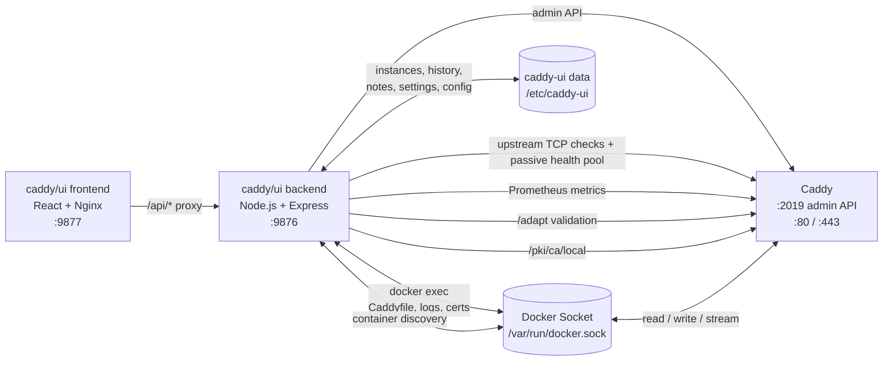

# Architecture

{{#include ../../README.md:architecture}}

```mermaid
graph LR
    FE["caddy/ui frontend\nReact + Nginx\n:9877"]
    BE["caddy/ui backend\nNode.js + Express\n:9876"]
    DS[("Docker Socket\n/var/run/docker.sock")]
    CA["Caddy\n:2019 admin API\n:80 / :443"]
    UI_DATA[("caddy-ui data\n/etc/caddy-ui")]

    FE -->|"/api/* proxy"| BE
    BE -->|"admin API"| CA
    BE -->|"upstream TCP checks + passive health pool"| CA
    BE -->|"Prometheus metrics"| CA
    BE -->|"/adapt validation"| CA
    BE -->|"/pki/ca/local"| CA
    BE <-->|"docker exec\nCaddyfile, logs, certs"| DS
    DS <-->|"read / write / stream"| CA
    BE <-->|"container discovery"| DS
    BE <-->|"instances, history,\nnotes, settings, config"| UI_DATA
```
